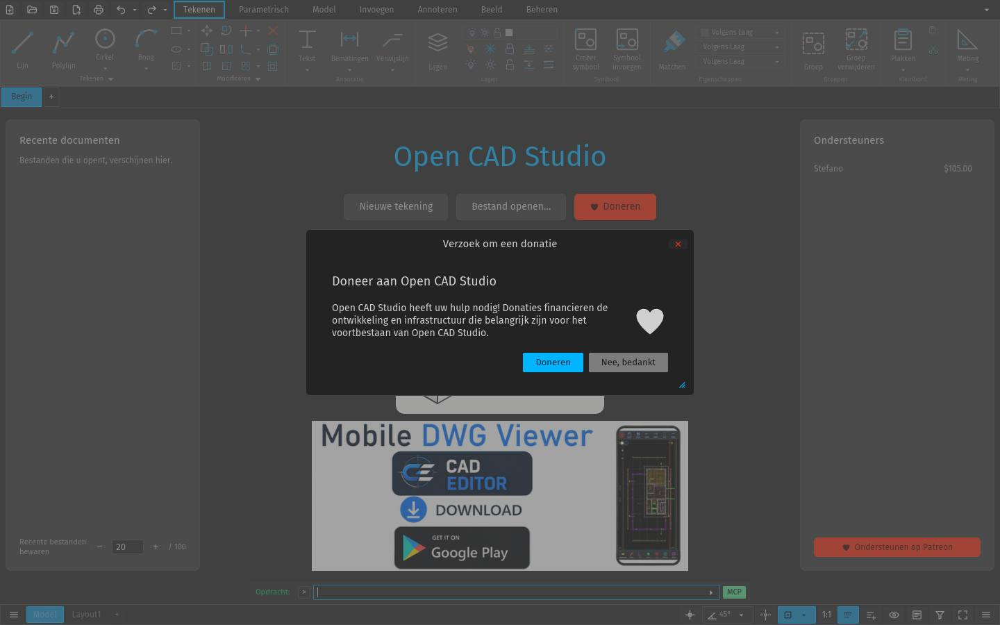

# Y-next

**Single-tenant web interface for ERPNext / Frappe v16** — a frontend that runs
on the same site as the data it shows.

Y-next is a fork of Y-app, rebuilt as a lightweight SPA that talks directly to
one Frappe/ERPNext environment. There is no backend of its own, no separate
authentication and no separate database: Y-next uses the existing session
(login/cookies) of the site it is published on, and reads and writes data
exclusively through the standard Frappe/ERPNext REST API.


---

## What Y-next is (and is not)

- One site, one Y-next installation: single-tenant, no instance switcher, no
  separate accounts.
- No sign-in form of its own: Y-next reuses the session of the site it is
  published on as a Web Page (route `/y-next`). When you are signed out it
  shows the screen above, which sends you to the Frappe sign-in page.
- All data — projects, invoices, mail, calendar, HR — comes straight from the
  REST API of that same site. No middle layer and no cache on a server of our
  own.
- No Express production server and no credential vault: those belonged to the
  original multi-instance Y-app architecture and do not apply to this fork.

---

## What it does

**Mail** — built on ERPNext `Communication` documents, so every message stays
linked to the project, customer or invoice it belongs to.

- Folders for inbox, sent, unread, handled and trash, plus folders per
  connection (project, customer, purchase invoice, sales invoice, quotation,
  lead).
- Search across subject, sender and recipients *and* across everything linked
  to a matching project or relation; picking a project or relation from the
  search bar opens its folder.
- Compose with a rich text editor, signatures generated from Frappe data,
  project linking, and drafts that live on the server instead of in one
  browser — so another tool (or an assistant) can prepare a message for you to
  review and send.
- Attachments open next to the mail: PDF, IFC models, Word/Excel/CSV
  (read-only) and DWG/DXF drawings, each in its own viewer, or full screen in
  a separate tab.
- Out-of-office replies, an importance flag, and a per-mail identifier you can
  copy to point at exactly one message.

**Calendar** — Frappe Events plus, where configured, the calendars on the mail
server (JMAP), with recurring appointments, duration presets, locations taken
from the address book, and a memory that fetches the weeks around the one you
are looking at.

**Drawings** — DWG and DXF open in [Open CAD Studio](https://www.opencadstudio.com/),
a WebAssembly CAD viewer hosted on the same site. It loads on the first drawing
you open, not before.



**Knowledge base** — a home page listing every article by topic, what changed
recently, and the articles you open most.

**And further** — dashboard, projects, tasks and planning, timesheets and
expenses, sales and purchase invoices, quotations, leads, HR, and the settings
screens.

Not active yet (they need a server or proxy): messages (NextCloud Talk),
documents (Nextcloud) and passwords.

`packages/server` and `packages/desktop` hold the original Y-app runtimes (the
Express backend and the Tauri desktop build). They are **not deployed** in this
fork, but stay in the repository because the messenger and the desktop variant
may return later.

---

## Development

```bash
npm install
npm run dev
```

Optional environment variables for local development:

| Variable | Default | Description |
|---|---|---|
| `VITE_ERPNEXT_URL` | `https://open-aec-studio-erp.prilk.cloud` | The site the Vite dev proxy talks to |
| `YNEXT_DEV_TOKEN` | — | Optional `key:secret` API token, added server-side by the dev proxy as an `Authorization` header only; it never reaches client code or the bundle |

Without `YNEXT_DEV_TOKEN`, ordinary cookie-based login through the site works
as well, because the dev server mimics the same origin behaviour as production.

## Testing

```bash
npm test
```

The suite is plain `node --test` over the TypeScript sources: pure modules with
no DOM, so the rules that decide what the app does are checked in milliseconds.

## Publishing

Y-next is published as a Frappe **Web Page** on route `/y-next`, with the built
assets as public **File** documents:

```bash
YNEXT_BASE_URL=https://your-site.example npm run deploy
```

`YNEXT_BASE_URL` decides which site you publish to — set it, or you publish to
the default in `scripts/deploy-y-next.mjs`. See
[`docs/deployment.md`](docs/deployment.md) for the full deploy, smoke test and
rollback procedure.

---

## Credits

The sign-in screen uses a photo from [Unsplash](https://unsplash.com/photos/gray-metal-structure-during-daytime-VZYBvXoPBYA),
free to use under the Unsplash License.

## License

Copyright [OpenAEC Foundation](https://github.com/OpenAEC-Foundation).
